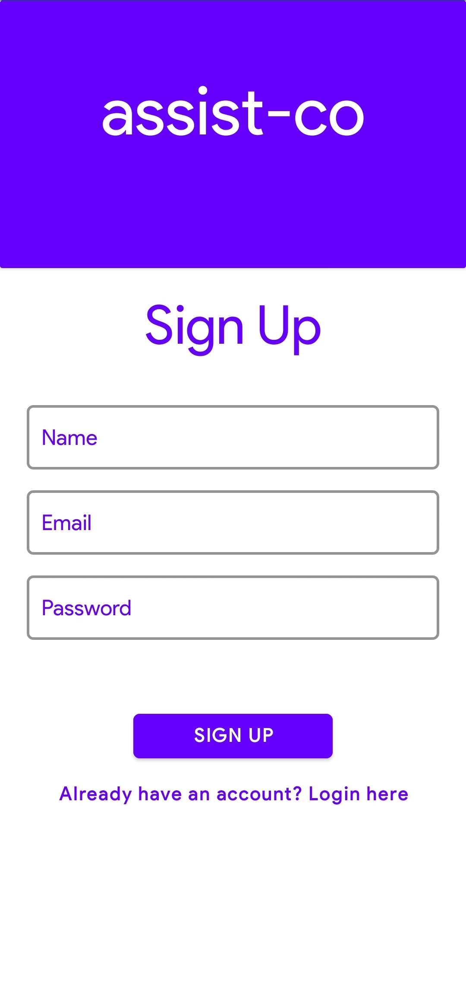
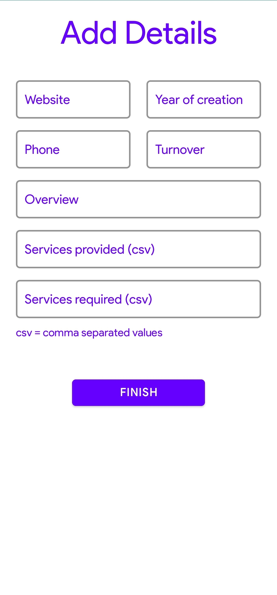
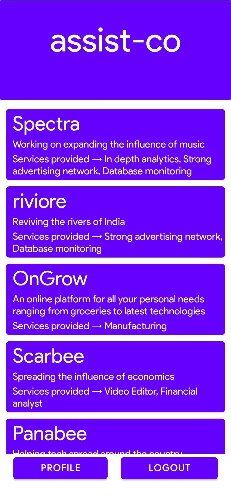
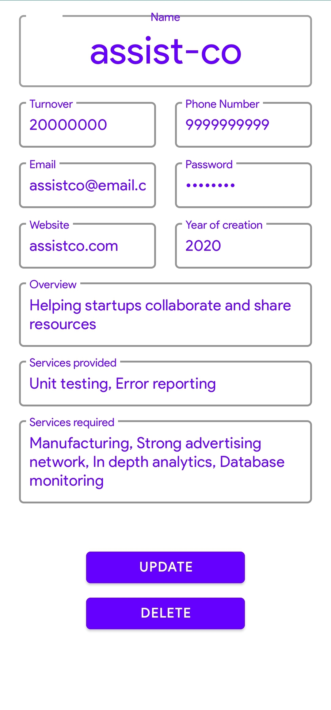

# assist-co

Helping startups collaborate and share resources - a step towards the knowledge economy.

## Why?

Knowledge Economy - An economy in which growth is dependent on the quantity, quality, and accessibility of the information available, rather than the means of production.  
Through research and surveys, we found that both, startups and small businesses, consider lack of resources as one of their biggest challenges. Moreover, with the pandemic hitting, problems such as dwindling incomes, decrease in the demand for a variety of products, and the altered work cultures have affected them heavily. Talking to some entrepreneurs, we realised that one way to tackle these issues is through **collaboration**.

## Solution

assist-co is an android app that helps facilitate collaboration amongst startups by helping companies **find** other suitable companies for them to collaborate with. It essentially bolsters the search for potential organisations and optimises this process of discovering other organisations.

Download assist-co on your Android devices [here](https://github.com/mihiraggarwal/assist-co/releases/download/v1.0.0-beta/app-release.apk).

## Working

- After signing up, a page comes up where some basic details of the company have to be entered.
- This leads the user to a screen wherein the names of companies who are registered on the app are visible.
- The user's  profile can be viewed, updated, and deleted, as per their convenience.

> The names of other companies will be sorted in the order of the number of common elements between the services the user requires and the services other companies can provide. In this way, companies can find other companies who have the potential to help them.

  
   
  
  
  

P.S - This is still a prototype
